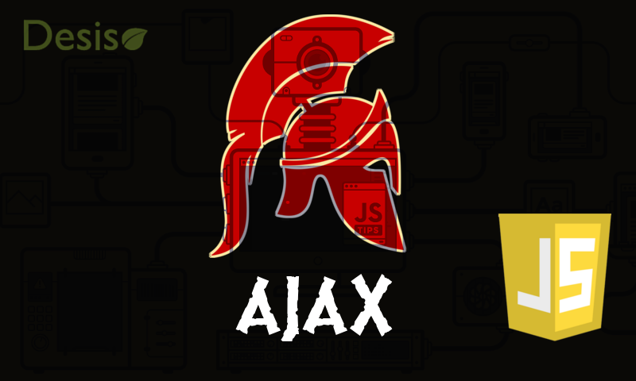
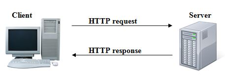

# Elementos de AJAX.
<div style="text-align: right; font-size:0.8rem;">por Andrés Reyes</div>


#### Versión de este documento
Versión 0.1.0

#### Objetivos
* Entender Ajax como un conjunto de tecnologías.
* Comprender el concepto de fenómeno asíncrono.
* Obtener una comprensión básica de las peticiones HTTP.
* Poder usar Ajax para realizar solicitudes HTTP.

#### Requisitos previos
* Tener comprensión básica de la arquitectura cliente-servidor
* Tener conocimientos básicos de programación
* Tener experiencia básica con Javascript

## ¿Que es AJAX?

Ajax es acrónimo de *Asyncronnous JAvascript and Xml* (las mayúsculas indican como se forma el acrónimo), y constituye un conjunto de tecnologías que permiten la comunicación y el intercambio de datos entre un cliente y un servidor de manera *asíncrona* y en segundo plano. Estas tecnologías han permitido, entre otras cosas, el surgimiento de [aplicaciones web enriquecidas](https://es.wikipedia.org/wiki/Rich_Internet_application), las cuales mejoran la experiencia del usuario.

<div style="font-size:0.7rem;">Ajax, era también el nombre de un héroe griego de la guerra de Troya  Por eso a veces encontrarás imagenes de hoplitas o cascos corintios en sitios dedicados a esta tecnología.</div>

## Sincronía, Asincronía, Diacronía.

Antes de continuar, será conveniente definir estos términos, pués no son del todo claros para cierto número de personas.

Gracias a Einstein sabemos que el tiempo es [relativo](https://es.wikipedia.org/wiki/Teor%C3%ADa_de_la_relatividad). Cada ser, objeto o fenómeno pareciera poseer su propia medida acerca de este y su transcurrir. Ahora bien, si dos fenómenos parecen tener una relación coordinada en como transcurren sus tiempos relativos, decimos que son **síncronos**. Podemos ver un ejemplo de esto en un conversación corriente entre dos individuos, normalmente esperan su turno para hablar, y un observador sabe con algún grado de certeza cuando hablará cada uno.

Por otro lado, cuando no podemos observar algun tipo de relación entre el tiempo relativo de dos fenómenos, decimos que son **asíncronos**. Un ejemplo puede ser el movimiento de dos automóviles que transitan en diferentes ciudades, o un individuo que observa pasar vehículos desde un paso sobre nivel en una autopista.

Una consecuencia importante de la **asincronía**, es que hace muy díficil (¡a veces casi imposible!) el hacer predicciones sobre un fenómeno, y muchas veces debemos *esperar el resultado de un evento* relativo a un fenómeno asíncrono para con nosotros, mientras hacemos otra cosa.

Finalmente, **diacronía** hace referencia a la observación de un fenómeno a lo largo de un periódo determinado de tiempo, haciendo énfasis en su **evolución**.
<div style="font-size:0.7rem;">En primera instancia, estos conceptos pueden parecer un poco intimidantes, baste para nuestro interés, entender sincronía como una coordinación entre fenómenos, individuos o eventos.</div>


## Peticiones HTTP

Indicamos que **Ajax** es una tecnología para el intercambio de información entre un cliente y un servidor, pero, ¿Como definimos ese intercambio?, ¿Como se produce?.

<div style="font-size:0.7rem;">No pretendemos explicar aquí todo lo referente a redes de computadores y la arquitectura cliente-servidor, si estos terminos te son extraños, <a href='https://www.ecured.cu/Arquitectura_Cliente_Servidor'>investiga primero</a>, y luego continúa con este artículo</div>


Entre las diferentes tecnologías que intervienen en lo que conocemos como Internet, el protocolo HTTP, o Hyper Text Transfer Protocol, es el encargado de transferir datos entre los miembros de la red. HTTP es la base de cualquier intercambio en la web, y se estructura sobre la arquitectura cliente-servidor, intercambiando mensajes individuales. Especificando; un ***cliente*** (quien requiere o hace uso de un *servicio*), normalmente en nuestro caso, un navegador web, también conocido como *agente de usuario*, envía mensajes conocidos como *peticiones* o *requests*, a un ***servidor*** (quien entrega uno o mas *servicios*), el cuál procesa la petición, y devuelve mensajes conocidos como *respuestas* o *responses* al cliente.

<div style="font-size:0.7rem;">Puedes aprender <strong>todo</strong> sobre HTTP en el documento rfc que lo define: el
<a href='https://tools.ietf.org/html/rfc2616'>RFC 2616</a></div>

### Tipos de peticiones HTTP

Existen diferentes peticiones HTTP:

* GET
* POST
* HEAD
* PUT
* DELETE

Pero en la actualidad de la industria, practicamente sólo se usan las dos primeras.

#### GET

***GET***, que en inglés significa obtener, conseguir o tomar, representa una petición donde esperamos que la respuesta sea un recurso especifico, y no esperamos causar cambios en el servidor. Simplemente pedimos un dato. Si bien en la practica podemos convertir el dato obtenido al tipo que requiramos, la respuesta del servidor, si la petición fué exitosa, será de tipo texto (texto plano, html, xml, etc.)

#### POST

***POST***, cuyo significado hace referencia a envíar (pensar en post office, oficina de correo), nos permite envíar una entidad u objeto al servidor, causando muchas veces, un cambio en este. Por ejemplo, una solicitud de eliminación de un dato o de inserción de un nuevo registro. La respuesta del servidor, si la petición fué exitosa, puede ser de tipo texto, o de algún tipo de dato especializado para el intercambio de información entre sistemas, como **json**.


## Nociones básicas de la arquitectura

Ya sabemos que HTTP se encarga de comunicar un cliente y un servidor, también intuimos que con cliente hacemos referencia a un [agente de usuario](https://es.wikipedia.org/wiki/Agente_de_usuario), un software que representa y/u ofrece facilidades a un usuario del mundo real para conectar con un servidor, y con servidor nos referimos a software encargado de procesar peticiones y entregar respuestas.
A grandes rasgos, las peticiones del agente de usuario son recibidas por un servidor web, el cuál las analiza. Si ha sido configurado para ello, entrega la petición a un programa escrito en algún [lenguaje de programación del lado de servidor](https://es.wikipedia.org/wiki/Script_del_lado_del_servidor), junto con los datos incluidos en ella. Este programa (en nuestro caso, un script [PHP](https://es.wikipedia.org/wiki/PHP)), agrega una nueva capa de procesamiento, que nos permite controlar y operar en el servidor. En este punto, podemos, por ejemplo, instruir a un [RDBMS](https://es.wikipedia.org/wiki/Sistema_de_gesti%C3%B3n_de_bases_de_datos_relacionales) para insertar, editar, borrar, u obtener datos, generando una respuesta que es entregada de vuelta al servidor web, quien la envía al agente de usuario, donde es renderizada y presentada al usuario.




Ajax funciona entre archivos con el mismo origen. Se considera tener el mismo origen si tienen la misma  combinación de esquema de url, nombre de host y número de puerto. Esto previene a un script con código malicioso de obtener acceso a datos en otra pagina web a través del DOM de la pagina. Esto es conocido como [Same-Origin Policy](https://en.wikipedia.org/wiki/Same-origin_policy).


## El objeto XMLHttpRequest

¡Finalmente!, despues de tantas definiciones es hora de arremangarnos y ensuciarnos las manos con código!

[XMLHttpRequest](https://xhr.spec.whatwg.org/) es una [api](https://www.ecured.cu/API) usada por distintos lenguajes, que nos provee los medios para hacer programaticamente peticiones HTTP a un servidor, es decir, se trata de una utilidad que nos permite implementar las técnicas de AJAX en nuestras aplicaciones web.
En este artículo, nos centraremos en su uso desde Javascript.

### Especificación del objeto XMLHttpRequest
Es altamente recomendable estudiar la especificación oficial del objeto [XMLHttpRequest](https://xhr.spec.whatwg.org/#event-xhr-readystatechange).

### Creando un objeto XMLHttpRequest

Crear un objeto XMLHttpRequest es muy facil en JS.
```javascript
var request = new XMLHttpRequest();
```
Voila! hemos creado nuestro objeto request con la api XMLHttpRequest, el cuál contiene todo lo que necesitamos para realizar peticiones al servidor.

### Abriendo la conexión. El método open.

El método open intenta abrir una conexión con el servidor especificado.

#### Sintaxis

```javascript
XMLHttpRequest.open(method, url [, async = true [, username = null [, password = null]]]);

Lanza un "SyntaxError" DOMException si method no es un método HTTP válido o
si la url no puede ser analizada.
Lanza un "SecurityError" DOMException si method es `CONNECT`, `TRACE`, o `TRACK`.
Lanza un "InvalidAccessError" DOMException si async es false, el actual objeto global es Window,
y atributo timeout es distinto a 0, o atributo responseType no es un string vacio.
```

#### Parámetros

* **method**
*String*.  El método de HTTP request a usar "GET", "POST", "PUT", "DELETE", etc.
* **url**
*String*.  URL donde envíar el request.
* **async**
*Boolean*. true por defecto, indica si la petición será asincrona.
* **user**
*String*. nombre de usuario opcional para propositos de autenticación. Null por defecto
* **password**
*String*.  password para propositos de autenticación. Null por defecto.


#### Uso

```javascript
var request = new XMLHttpRequest();

var url    = 'archivo.txt',
    method = 'GET',
    async  = true;

request.open(method, url, async);
```

### Enviando la petición. El método send.

Este método envía la petición al servidor, si el request es asincrono, retorna tan pronto como el request es enviado, y la respuesta es recibida vía eventos. Si el request es síncrono, el método no retorna hasta que la respuesta haya sido recibida. Es decir, cuando enviemos la petición usando el método send(), si el parámetro async del método open() fué indicado como `false`, send() detendrá la ejecución de la aplicación hasta que obtenga una respuesta del servidor, o se venza el plazo establecido para esperar por estas. En este último caso, se genera una excepción por [timeout](https://developer.mozilla.org/en-US/docs/Web/API/XMLHttpRequest/timeout).
Pensando en la experiencia de usuario, los request síncronos han sido deprecados.

#### Sintaxis

```javascript
XMLHttpRequest.send(body)
```


#### Parámetros

* **body**
Los datos que serán enviados en la petición XHR. Estos pueden ser:
    * Un documento, en cuyo caso debe ser [serializado](https://es.wikipedia.org/wiki/Serializaci%C3%B3n).
    * Un tipo especial de dato, como un [Blob](https://es.wikipedia.org/wiki/Binary_large_object), un [BufferSOurce](https://developer.mozilla.org/en-US/docs/Web/API/BufferSource), un [FormData](https://developer.mozilla.org/es/docs/Web/API/XMLHttpRequest/FormData), un [URLSearchParams](https://developer.mozilla.org/es/docs/Web/API/URLSearchParams), un [ReadableStream](https://developer.mozilla.org/en-US/docs/Web/API/ReadableStream), o un objeto [USVString](https://developer.mozilla.org/en-US/docs/Web/API/USVString).

Según la especificación, si se omite, el parámetro body tomará el valor de null.

En este artículo nos centraremos en la primera forma de envío de datos.

<div style="font-size:0.7rem;">Nota. XMLHttpRequest tiene 2 versiones que corresponden con dos revisiones mayores de la api. Si buscas información en otras fuentes, puedes encontrar métodos o propiedades que no aparecen en este artículo. Si bien ambas revisiones son válidas, recomendamos usar las descritas aquí, pués son ampliamente usadas en los sistemas de la organización.</div>

#### Uso


```javascript
var request = new XMLHttpRequest();

/*
En este caso, archivo.txt es un ejemplo. En otras palabras, estamos solicitando el
contenido de este archivo, que debería estar ubicado en el mismo servidor que el
archivo javascript que origina esta petición
*/
var url    = 'archivo.txt',
    method = 'GET',
    async  = true;

request.open(method, url, async);
request.send();
```

### Procesando la respuesta del servidor

#### La propiedad readyState del objeto XMLHttpRequest

Cuando la petición que hemos solicitado es de naturaleza asíncrona, es decir, el parámetro async del método open() esta establecido como `false`, nuestra app sigue su propio flujo, hasta recibir la respuesta del servidor, pero, ¿Como sabemos cuando llegará esa respuesta? Pués bien, la api XMLHttpRequest ha definido la propiedad [readyState](https://xhr.spec.whatwg.org/#event-xhr-readystatechange) para almacenar el estado del procesamiento de nuestra petición.

La especificación XHR indica la definición de esta propiedad, y la de los valores que puede tomar.
```javascript
  const unsigned short UNSENT = 0;
  const unsigned short OPENED = 1;
  const unsigned short HEADERS_RECEIVED = 2;
  const unsigned short LOADING = 3;
  const unsigned short DONE = 4;
  readonly attribute unsigned short readyState;
```


La siguiente tabla muestra la espcificación XHR para los valores que puede tomar la propiedad **readyState**.

<table>
<thead>
  <tr>
    <th>Valor</th><th>Constante XHR</th><th>Significado</th><th>Definición</th>
  </tr>
</thead>
<tbody>
  <tr>
    <td>0</td><td>UNSENT</td><td>No enviado</td><td>El objeto XHR ha sido construido.</td>
  </tr>
  <tr>
    <td>1</td><td>OPENED</td><td>Conexión abierta</td><td>El método open() fué ejecutado exitosamente.</td>
  </tr>
  <tr>
    <td>2</td><td>HEADERS_RECEIVED</td><td>Cabeceras recibidas</td><td>El método send se ha ejecutado y las cabeceras HTTP de la respuesta han sido recibidas</td>
  </tr>
  <tr>
    <td>3</td><td>LOADING</td><td>Cargando respuesta</td><td>El cuerpo de la respuesta se está recibiendo</td>
  </tr>
  <tr>
    <td>4</td><td>DONE</td><td>transferencia completa</td><td>La transferencia de datos se ha completado, o algo salio mal durante la transferencia</td>
  </tr>
</tbody>
</table>

Cada vez que la propiedad **readyState** cambia, se dispara el evento **onreadystatechange**, al cual podemos asignarle una función *listener* que se ejecutará con cada cambio en **readyState**. De esta manera podemos saber el momento en que regrese la respuesta del servidor, lo que, como se explicita en la tabla anterior, ocurre cuando **readyState** adopta el valor `4`.

```javascript
var request = new XMLHttpRequest();

var url    = 'archivo.txt',
    method = 'GET',
    async  = true;

/* Asignamos la función al evento*/
request.onreadystatechange = function() {
    /*
    Se le pasará el control a esta función cada vez que readyState cambie su valor, es decir
    por cada cambio de estado del objeto XMLHttpRequest.
    */
    if (this.readyState == 4) {
        /*
        Cuando la propiedad readyState tenga un valor de 4, querrá decir que la transferencia
        se ha completado, y se ha recibido la respuesta del servidor.
        Es aquí donde podemos poner nuestro código para trabajar con la respuesta.
        */
    }
};

request.open(method, url, async);
request.send();
```

#### La propiedad status del objeto XMLHttpRequest

La forma de saber si la respuesta del servidor se recibió sin problemas, una vez que nuestra petición esta completa, es recurriendo a la propiedad [status](https://xhr.spec.whatwg.org/#dom-xmlhttprequest-status) del objeto XMLHttpRequest.

```javascript
//Indica estado de la respuesta del servidor
readonly attribute unsigned short status;
```

La propiedad status, adoptara el valor de 200, cuando **readyState** tenga un valor de 4 **DONE**, y la respuesta del servidor se reciba sin errores.

<div style="font-size:0.7rem;">Puedes revisar la <a href='https://developer.mozilla.org/es/docs/Web/HTTP/Status'>especificación</a> de los distintos valores que puede adoptar la propiedad status.</div>


```javascript
var request = new XMLHttpRequest();

var url    = 'archivo.txt',
    method = 'GET',
    async  = true;

/* Asignamos la función al evento*/
request.onreadystatechange = function(){
    /*
    Se le pasará el control a esta función cada vez que readyState cambie su valor, es decir
    por cada cambio de estado del objeto XMLHttpRequest.
    */
    if (this.readyState == 4) {
       if (this.status == 200) {
           /**
           En este punto, en el que readyState es igual a 4 y status es igual a 200
           es donde sabemos que la petición se completó sin problemas, y que la respuesta
           fué recibida sin errores.
           **/
       }
    }
};

request.open(method, url, async);
request.send();
```

### Ejemplo completo de petición GET

El siguiente es un ejemplo de solicitud http vía Ajax a un script PHP.

Script PHP que procesará nuestras peticiones de ejemplo en el servidor.

```php
/**
 * command.php
 */

/*
Recuperamos el valor de un dato enviado a través del método GET,
usando el superglobal $_GET
*/
$cmd = $_GET["cmd"];


/*
Discriminamos que solicitud vamos a procesar.
Podemos usar un simple switch case, o usar alguna variante del patron estrategia.
*/
switch ($cmd) {

    case "ejemploPeticionTextoPlano":
    /*
    Aquí procesaremos una petición que espera por respuesta texto plano.
    */
        $nombre      = $_GET["nombre"];
        $response    = "hola " . $nombre .". Tu petición ajax se completó sin problemas.";
        $contentType = "Content-Type: text/plain";
        break;
    default:
    /*
    Aquí procesaremos que hacer en caso de no reconocer la petición solicitada.
    */
        $response = "No reconozco el comando";
        $contentType = "Content-Type: text/plain";
        break;

}

/*
Establecemos el tipo de respuesta declarando expresamente los headers que enviaran información
al navegador para indicarle como tratar la respuesta.
*/
header($contentType);
/*
Ponemos la respuesta en el buffer de transporte. El servidor HTTP redirigirá la respuesta
al agente de usuario que originó la petición.
*/
echo($response);
die;
//Nos aseguramos de terminar la ejecución del script con die, debido a que
//no hacerlo, pueden provocarse casos de inclusión de fragmentos de código o caracteres extraños
//en la respuesta.
```

index.html
```html
<!DOCTYPE HTML>
<html>
    <head>
        <meta charset='UTF-8' />
        <title>Ajax. Ejemplo uso API XMLHttpRequest</title>
    </head>
    <body>
        <div id='container'>
            <form onsubmit='return false;'>
                 <p>
                     Nombre :
                     <input id='nombre' type='text' />
                </p>
                <button id='enviar-por-get'>Enviar petición Get</div>
            </form>
        </div>
        <script src='controlador.js'></script>
    </body>
</html>
```

controlador.js
```javascript
var request = new XMLHttpRequest();

/*
Asignamos el listener para el evento onreadystatechange
*/
request.onreadystatechange = function(){

    if (this.readyState == 4) {
       if (this.status == 200) {
           /*
            Al momento de completarse exitosamente la petición, publiquemos la respuesta con un alert()
           */
           alert(this.response);
       }
    }
};


/*
Cuando la pagina se haya cargado, le agregamos un listener al evento click del boton.
*/
window.onload = function(e) {
    var button   = document.getElementById('enviar-por-get');
    var inNombre = document.getElementById('nombre');


    /*
    Cuando el boton reciba un click, iniciaremos la petición Ajax.
    Recuerda que cada vez que la petición cambie de estado, se ejecutará la función
    asignada a XMLHttpRequest.onreadystatechange.
    */
    button.addEventListener('click', function(e){
        var nombreValue = inNombre.value;
        var url    = 'command.php',
            method = 'GET',
            async  = true;

        /*
        Como es una petición GET, agregamos los datos a enviar a la url.
        En este caso, el cmd y un nombre.
        */
        request.open(
            method,
            url + '?cmd=ejemploPeticionTextoPlano&nombre=' + encodeURI(nombreValue),
            async
        );

        //Enviamos la petición
        request.send();
    });
}
```

## Creando nuestro objeto XMLHttpRequest personalizado.

Puede ser una buena idea crear nuestro propio objeto XMLHttpRequest que nos permita manipular esta api convenientemente, ahorrando tiempos de configuración u otros.

Hay muchas formas de hacer esto [Personalizando la cadena de prototipos](https://developer.mozilla.org/es/docs/Web/JavaScript/Herencia_y_la_cadena_de_prototipos) (considerado una [mala idea](http://perfectionkills.com/whats-wrong-with-extending-the-dom/)), o usando el [patrón decorador](https://es.wikipedia.org/wiki/Decorator_(patr%C3%B3n_de_dise%C3%B1o)), y envolver al objeto XMLHttpRequest con otro objeto y encapsular las funcionalidades que necesitemos utilizar.
En este artículo seguiremos la segunda aproximación.

Preparamos nuestra [clase prototípica](https://developer.mozilla.org/es/docs/Web/JavaScript/Herencia_y_la_cadena_de_protipos).
```javascript
var _Request = function(options, undefined) {
}
```

Por el momento, simplemente se trata del contenedor de una función. Options es un **JSON** que contiene las opciones de configuración para nuestro objeto. Undefined es un marcador que no usaremos, pero que permite que el tipo primitivo undefined no sea sobreescrito, evitando así posibles problemas.

<div style="font-size:0.7rem;">Es un poco complejo de explicar en un espacio tan reducido (y escapa a los propositos de este artículo) pero si tienes interés puedes averiguar más sobre los
<a href='https://dmitripavlutin.com/7-tips-to-handle-undefined-in-javascript/'>undefined type hacks</a> de Javascript.
</div>


Continuamos con *`_self`*, una variable local donde guardamos una referencia a nuestro objeto, para usarla
en ámbitos donde el contexto pueda ser un poco confuso.

Además, configuramos un set de opciones por defecto en la variable *`_defaultConfig`*, en caso de que no se incluyan en el parámetro *`options`*.

Si te fijas, adjuntamos un **`_`** al principio del nombre de las variables locales. No es obligatorio, pero es un considerado buena práctica para identificar de un vistazo los elementos pertenecientes al ámbito local.
```javascript
var _Request = function(options, undefined) {
    var _self = this;
    var _defaultConfig = {
        url    : '',
        method : 'POST',
        header : {
            content : "Content-Type",
            type    : "application/x-www-form-urlencoded"
        },
        async              : true,
        user               : null,
        password           : null,
        whenReady          : function(request) {
            if (_self.useDefaultBehaviour) {
                alert('Listo!');
            }
        },
        whenNotInitialized : function(request) {
            if (_self.useDefaultBehaviour) {
                alert('no Inicializado aún');
            }
        },
        whenConnected      : function(request) {
            if (_self.useDefaultBehaviour) {
                alert('Conexión establecida');
            }
        },
        whenReceived       : function(request) {
            if (_self.useDefaultBehaviour) {
                alert('El servidor ha recibido la petición');
            }
        },
        whenProcessing     : function(request) {
            if (_self.useDefaultBehaviour) {
                alert('Procesando la petición');
            }
        },
        useDefaultBehaviour: true
    };

}
```
*`options`* y *`_defaultConfig`* tienen una propiedad llamada *`whenReady`*, la cuál es una *función callback* a la que llamaremos cuando obtengamos la respuesta del servidor.

Verás que *`_defaultConfig`* tiene una propiedad llamada *`header`*. Su finalidad es representar a las cabeceras HTTP que consisten en meta información que se envía al servidor, la cuál complementa nuestra petición, o la respuesta del servidor.

<div style="font-size:0.7rem;">Puedes encontrar una tabla de los distintos tipos de cabeceras HTTP en
<a href='https://es.wikipedia.org/wiki/Anexo:Cabeceras_HTTP'>Wikipedia</a>.
</div>


Dentro de la configuración por defecto, incluimos una serie de funciones (*`whenNotInitialized`*, *`whenConnected`*, *`whenReceived`* y *`whenProcessing`*) que se ejecutarán al momento de cambiar de valor la propiedad *`readyState`* del objeto **XMLHttpRequest**, esto nos dará un grado fino de control sobre el flujo de nuestras peticiones. En este ejemplo, simplemente las funciones ejecutan un *`alert()`* indicando el paso en ejecución. Pero perfectamente podriamos usarlas para implementar sofisticadas interfaces para nuestras aplicaciones, por ejemplo, barras de progreso para indicar el estado de nuestras peticiones. Si al momento de usar nuestro objeto personalizado, no incluimos estas funciones en el parametro *`options`* , se usaran las versiones contenidas en la configuración por defecto, *`_defaultConfig`*.


Continuamos verificando que *`options`* sea definido al momento de llamar a nuestro objeto, de lo contario, le asignamos las opciones por defecto.
```javascript
var _Request = function(options, undefined) {
.
.
.
    options = (options == undefined ? _defaultConfig : options);
}
```

Pero no basta con eso, también debemos verificar que las propiedades hayan sido definidas individualmente.

```javascript
var _Request = function(options, undefined) {
.
.
.
    options = (options == undefined ? _defaultConfig : options);

    this.url      = (options.url    || _defaultConfig.url);
    this.method   = (options.method || _defaultConfig.method);
    this.async    = (options.async !== undefined ? options.async : _defaultConfig.async);
    this.user     = (options.user ? options.user : _defaultConfig.user);
    this.password = (options.password ? options.password : _defaultConfig.password);
    this.useDefaultBehaviour = (options.useDefaultBehaviour !== undefined ?
                                options.useDefaultBehaviour  : _defaultConfig.useDefaultBehaviour);

    options.header       = (options.header || _defaultConfig.header);
    this.header          = (options.header || _defaultConfig.header);
    this.header.content  = (options.header.content ? options.header.content : undefined);
    this.header.type     = (options.header.type    ? options.header.type    : undefined);

    this.whenReady = (options.whenReady || _defaultConfig.whenReady);
}
```

Ahora que ya verificamos a *`options`* y sus propiedades, y tenemos un conjunto de configuraciones por defecto seguras, procedemos a crear el objeto XMLHttpRequest que estamos decorando, y asignar el *listener* al evento *`onreadystatechange`*.

```javascript
var _Request = function(options, undefined) {
.
.
.
    this.request = new XMLHttpRequest();

    this.request.onreadystatechange = function() {

        switch(this.readyState) {
            case 4:
                switch (this.status) {
                    case 200:
                        if (typeof _self.whenReady === 'function') {
                            _self.whenReady(_self.request);
                        }
                        break;
                    case 400:
                        this.error = '400 Bad Request. El request no pudo ser entendido por el servidor debido a sintaxis incorrecta. Revise su url';
                        break;
                    case 401:
                        this.error = '401 Unauthorized. El request requiere autenticación de usuario';
                        break;
                    case 403:
                        this.error = '403 Forbbiden. El servidor entendió el request, pero se niega a responder.';
                        break;
                    case 404:
                        this.error = '404 No encontrado. El servidor no encontró la url';
                        break;
                    case 500:
                        this.error = '500 error del servidor. Algo pasó en el servidor.';
                        break;
                    default:
                        break;
                }
                break;
            case 0: //request no inicializado
                (options.whenNotInitialized || _defaultConfig.whenNotInitialized)(this.request);
                break;
            case 1: //server conexión establecida
                (options.whenConnected || _defaultConfig.whenConnected)(this.request);
                break;
            case 2: //request recibido
                (options.whenReceived || _defaultConfig.whenReceived)(this.request);
                break;
            case 3: //procesando request
                (options.whenProcessing || _defaultConfig.whenProcessing)(this.request);
                break;
            default:
                break;
        }

    };
}
```

Veras que hemos reemplazado las construcciones *`if`* del ejemplo básico, por *`switch-case`*. Esto nos permite mayor versatilidad para comprobar muchos tipos de situaciones y estados de las propiedades *`readyState`* y *`status`*. De esta manera, podemos manejar distintas formas de respuesta del servidor.

Notaras también el siguiente tipo de sentencia:
```javascript
(options.whenNotInitialized || _defaultConfig.whenNotInitialized)(this.request);
```
Esto puede leerse como (ejecuta esta función si esta definida ||(ó) esta otra si está definida)(con estos parámetros).

De esta forma, si las funciones callback para cada caso de cambio de estado de la propiedad *`readyState`* fueron definidas en el parámetro *`options`*, se ejecutan, de lo contrario se ejecutan las almacenadas en la configuración por defecto *`_defaultConfig`*.


Por comodidad, agregamos los métodos *`open()`* y *`send()`* para acceder a los métodos del mismo nombre del objeto **XMLHttpRequest** que estamos decorando.
Tomemos especial atención en la forma en que definimos métodos en Javascript, usando la cadena prototípica.


```javascript
var _Request = function(options, undefined) {
.
.
.
};

_Request.prototype.open = function(undefined) {
    this.request.open(this.method, this.url, this.async, this.user, this.password);
    return this;
};

_Request.prototype.send = function(body, undefined) {

    if (typeof this.method == 'string') {
        if (this.method === 'POST') {
            encodedBody = 'body=' + JSON.stringify(body);
            this.request.setRequestHeader(
                this.header.content,
                this.header.type
            );
        }

        if (this.method === 'GET') {
            encodedBody = null;
        }

        this.request.send(encodedBody);
    }
    return this;
};

```


### Código completo y comentado de nuestra clase prototípica decorada del objeto **XMLHttpRequest**

```javascript
/**
 * _Request.js
 */

/**
 * _Request
 *
 * Tiene la responsabilidad de encapsular el objeto XmlHttpRequest
 * para realizar peticiones Ajax. Si se omite el parametro options,
 * usa configuración por defecto, si se omite alguna de las propiedades
 * de options, obtiene la correspondiente desde la configuracion por
 * defecto.
 *
 * Compatible desde IE9 en adelante.
 *
 * @author Andrés Reyes
 *
 * @param {Json} options objeto js con la siguiente estructura:
*             {
*                 url       :  String  url contra cuál se realizará la petición.
*                                          Si el método es GET, url debe contener uri encoded los
*                                          datos de la petición.
*                 method    :  String  método de la petición HTTP
*                 header    :  Json
*                              {
*                                  content  : String
*                                  type     : String forma en que se enviaran los datos
*                              }
*                 async               : Bool     Indica si la petición es asyncrona
*                 whenReady           : Function función que se ejecutará cuando está lista la petición
*                 whenNotInitialized  : Function función que se ejecutará mientras
*                                                no se inicialice la petición
*                 whenConnected       : Function función que se ejecutará al momento
*                                                de establecer conexión
*                 whenReceived        : Function función que se ejecutará cuando
*                                                el server reciba los datos enviados
*                 whenProcessing      : Function función que se ejecutara mientras
*                                                el server procesa la petición
*                 useDefaultBehaviour : Bool     Si verdadero, usa funciones por defecto. Si falso,
*                                                no hara uso de las funciones por defecto.
*             }
*/
var _Request = function(options, undefined) {
    /**
     * _self  almacena una referencia al objeto, para usarla cuando el contexto pueda ser confuso.
     */
    var _self = this;
    /**
     * _defaultConfig  contiene configuraciones por defecto para nuestro objeto.
     */
    var _defaultConfig = {
        url    : '',
        method : 'POST',
        header : {
            content : "Content-Type",
            type    : "application/x-www-form-urlencoded"
        },
        async              : true,
        user               : null,
        password           : null,

        /**
         * whenReady
         *
         * Función que se ejecutará cuando la respuesta del servidor este lista, si no se ha provisto una
         * en el parámetro options
         *
         * @param  Object request el objeto XMLHttpRequest que porta nuestra petición
         * @return void
         */
        whenReady          : function(request) {
            if (_self.useDefaultBehaviour) {
                alert('Listo!');
            }
        },

        /**
         * whenNotInitialized
         *
         * Función que se ejecutará mientras no se inicialice la petición
         *
         * @param  Object request el objeto XMLHttpRequest que porta nuestra petición
         * @return void
         */
        whenNotInitialized : function(request) {
            if (_self.useDefaultBehaviour) {
                alert('no Inicializado aún');
            }
        },

        /**
         * whenConnected
         *
         * Función que se ejecutará mientras no se inicialice la petición
         *
         * @param  Object request el objeto XMLHttpRequest que porta nuestra petición
         * @return void
         */
        whenConnected      : function(request) {
            if (_self.useDefaultBehaviour) {
                alert('Conexión establecida');
            }
        },

        /**
         * whenReceived
         *
         * Función que se ejecutará cuando el server reciba los datos enviados
         *
         * @param  Object request el objeto XMLHttpRequest que porta nuestra petición
         * @return void
         */
        whenReceived       : function(request) {
            if (_self.useDefaultBehaviour) {
                alert('El servidor ha recibido la petición');
            }
        },

        /**
         * whenProcessing
         *
         * Función que se ejecutara mientras el server procesa la petición
         *
         * @param  Object request el objeto XMLHttpRequest que porta nuestra petición
         * @return void
         */
        whenProcessing     : function(request) {
            if (_self.useDefaultBehaviour) {
                alert('Procesando la petición');
            }
        },

        /**
         * useDefaultBehaviour Si es true, se usarán las funciones de la configuración por defecto,
         *                     si es false, no se ejecutarán.
         */
        useDefaultBehaviour: true
    };

    /* Verifica si options está definido, en caso contrario, usa configuraciones por defecto */
    options = (options == undefined ? _defaultConfig : options);

    this.url      = (options.url    || _defaultConfig.url);
    this.method   = (options.method || _defaultConfig.method);
    this.async    = (options.async !== undefined ? options.async : _defaultConfig.async);
    this.user     = (options.user ? options.user : _defaultConfig.user);
    this.password = (options.password ? options.password : _defaultConfig.password);

    this.useDefaultBehaviour = (options.useDefaultBehaviour !== undefined ?
                                options.useDefaultBehaviour  : _defaultConfig.useDefaultBehaviour);

    options.header       = (options.header || _defaultConfig.header);
    this.header          = (options.header || _defaultConfig.header);
    this.header.content  = (options.header.content ? options.header.content : undefined);
    this.header.type     = (options.header.type    ? options.header.type    : undefined);

    this.whenReady = (options.whenReady || _defaultConfig.whenReady);

    this.request   = new XMLHttpRequest();

    /*
    Establece controlador de cambio de estados de propiedad readyState.
    Si bien se ofrece está funcionalidad, nada impide que crees una propia y sobreescribas
    si lo consideras necesario.
    */
    this.request.onreadystatechange = function() {

        switch(this.readyState) {
            case 4:
                switch (this.status) {
                    case 200:
                        if (typeof _self.whenReady === 'function') {
                            _self.whenReady(_self.request);
                        }
                        break;
                    case 400:
                        this.error = '400 Bad Request. El request no pudo ser entendido por el servidor debido a sintaxis incorrecta. Revise su url';
                        break;
                    case 401:
                        this.error = '401 Unauthorized. El request requiere autenticación de usuario';
                        break;
                    case 403:
                        this.error = '403 Forbbiden. El servidor entendió el request, pero se niega a responder.';
                        break;
                    case 404:
                        this.error = '404 No encontrdo. El servidor no encontró la url';
                        break;
                    case 500:
                        this.error = '500 error del servidor. Algo pasó en el servidor.';
                        break;
                    default:
                        break;
                }
                break;
            case 0: //request no inicializado
                (options.whenNotInitialized || _defaultConfig.whenNotInitialized)(this.request);
                break;
            case 1: //server coneción establecida
                (options.whenConnected || _defaultConfig.whenConnected)(this.request);
                break;
            case 2: //request recibido
                (options.whenReceived || _defaultConfig.whenReceived)(this.request);
                break;
            case 3: //procesando request
                (options.whenProcessing || _defaultConfig.whenProcessing)(this.request);
                break;
            default:
                break;
        }
    };
};

/**
 * _Request.prototype.open
 *
 * Tiene la responsabilidad de establecer una conexión entre el cliente y el servidor que recibirá
 * la petición Ajax
 *
 * @return void
 */
_Request.prototype.open = function(undefined) {
    this.request.open(this.method, this.url, this.async);
    return this;
};

/**
 * _Request.prototype.send
 *
 * Tiene la responsabilidad de envíar los datos desde el cliente al servidor usando la
 * conexión establecida en el método open()
 *
 * Si el request es de método POST, el parámetro body es un json conteniendo los datos
 * a envíar, incluyendo la identificación de la petición
 *
 * @param  mixed body JSON si el método es post, null si el método es GET.
 * @return void
 */
_Request.prototype.send = function(body, undefined) {

    if (typeof this.method == 'string') {
        if (this.method === 'POST') {
            encodedBody = 'body=' + JSON.stringify(body);
            this.request.setRequestHeader(
                this.header.content,
                this.header.type
            );
        }

        if (this.method === 'GET') {
            encodedBody = null;
        }

        this.request.send(encodedBody);
    }
    return this;
};

```

### Ejemplo funcional de uso de nuestro objeto XMLHttpRequest decorado.

#### Script PHP de lado de servidor que recibirá las peticiones

```php
error_reporting(E_ALL);
ini_set('display_errors', '1');

//Descomentar para probar método post
//$raw         = file_get_contents("php://input");
//$encodedBody = json_decode($raw, true);
//descomentar para probar método post
//$cmd = $encodedBody["cmd"];

//Descomentar para probar método get
$cmd = $_GET["cmd"];


switch ($cmd) {
    case 'test':
        $response = [];
        $response["success"] = true;
        $response["error"]   = "";
        $response["data"]    = "Hola " . $encodedBody["dato"];
        $response            = json_encode($response);
        $headers             = 'Content-Type: application/json';
        break;
    case 'testGet':
        $dato1 = getRequest('dato1');
        $dato2 = getRequest('dato2');
        $response = "RESPONSE OK***SUCCESS true***DATA " . $dato1 . "," .$dato2;
        $headers  = "Content-Type: text/plain";
        break;
    default:
        $response = [];
        $response["success"] = true;
        $response["error"]   = "No se reconoce comando";
        $response            = json_encode($response);
        $headers             = 'Content-Type: application/json';
        break;
}

header($headers);
echo ($response);
die;
```

#### index.html

```html
<!doctype html>
<html>
<head>
    <meta charset="UTF-8" />
    <title>Ajax tester</title>
</head>
<body>
    <div id="container">

        <form id="send-files" onsubmit="return false;">
            <button id="enviar-post">Probar envío por post</button>
            <button id="enviar-get">Probar envío por get</button>
        </form>
    </div>

<script src='_Request.js'></script>
<script src='controlador.js'></script>
</body>
</html>
```

```javascript

/**
 * listoEnvioPorPost
 *
 * Función callback que se registra para ser ejecutada cuando la petición
 * vía método POST se complete.
 */
function listoEnvioPorPost(request) {
    alert('¡Se ha completado el envío por el método post!');
    console.log(request);
}

/**
 * listoEnvioPorGet
 *
 * Función callback que se registra para ser ejecutada cuando la petición
 * vía método GET se complete.
 */
function listoEnvioPorGet(request) {
    alert('¡Se ha completado el envío por el método get!');
    console.log(request);
}


window.onload = function(e) {
    var requestByPost = new _Request({
        url       : 'command.php',
        method    : 'POST',
        whenReady : listoEnvioPorPost //Se ejecutará cuando
                                      //readyState == 4 y status == 200
    });

    /* Contiene el request por método GET, incluye los datos a enviar en la url */
    var requestByGet = new _Request({
        url       : 'command.php?cmd=testGet&dato1=jacoboGet&dato2=sofiaGet',
        method    : 'GET',
        whenReady : listoEnvioPorGet, //Se ejecutará cuando
                              //readyState == 4 y status == 200
        useDefaultBehaviour : false
    });

    var botonPost = document.getElementById('enviar-post');
    var botonGet  = document.getElementById('enviar-get');

    botonPost.addEventListener("click", function(e){
        /* Envía los datos por método post a través del parámetro body */
        requestByPost.open().send({
            cmd   : 'test',
            dato  : 'jacobopus'
        });
    });

    botonGet.addEventListener("click", function(e){
        requestByGet.open().send();
    });

};

```
